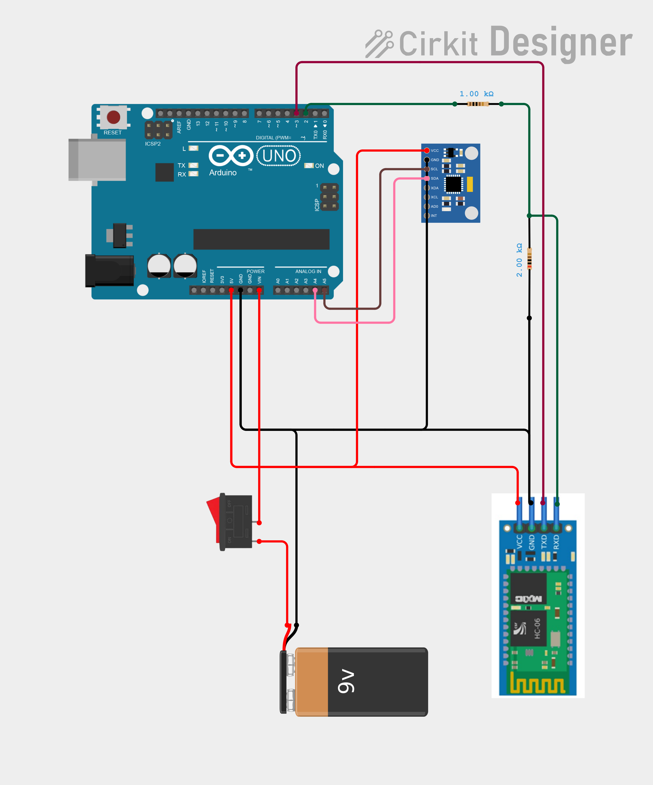
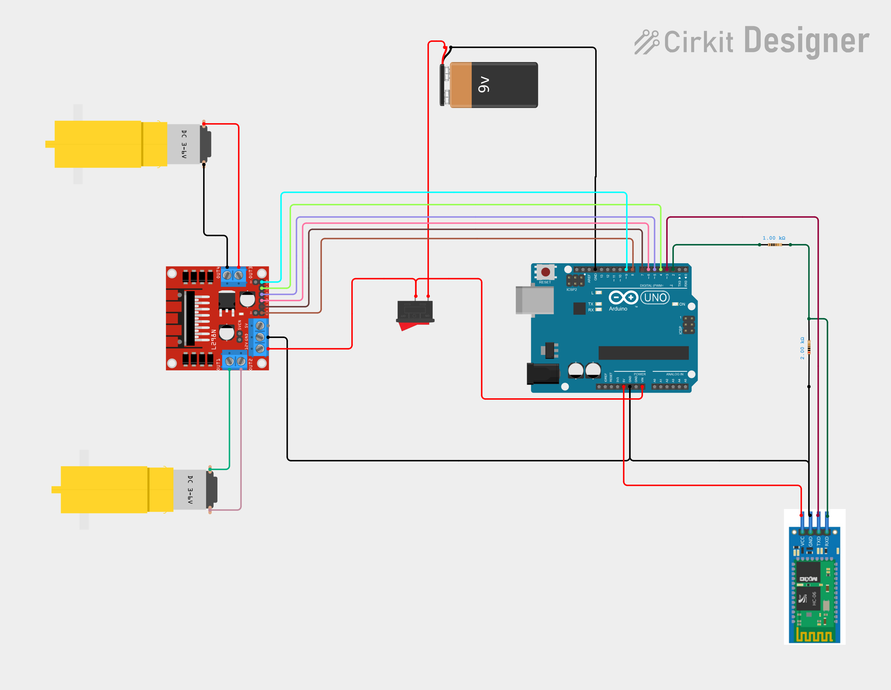

# Gesture Controlled RC Car

A wireless RC car controlled by hand gestures using an MPU6500 IMU sensor 
and HC-05 Bluetooth modules. Tilting the remote controller forward, 
backward, left, or right drives the car in the corresponding direction 
in real time.

## Demo


[Watch the Full Demo](https://github.com/Dubem1407/gesture-controlled-rc-car/releases/tag/v1.0.0)

## Hardware


### Master Remote (Transmitter)
- Arduino Nano
- MPU6500 IMU (accelerometer + gyroscope)
- HC-05 Bluetooth Module

### Slave Car (Receiver)
- Arduino UNO
- HC-05 Bluetooth Module
- L298N Motor Driver
- 2x DC Motors

## How It Works
The master remote reads tilt angles from the MPU6500 and transmits 
directional commands over Bluetooth via the HC-05 module. The slave car 
receives these commands and drives the motors accordingly through the 
L298N H-bridge motor driver.

## Wiring Diagram

### Master Remote

The master remote uses an Arduino Nano*, MPU6500 IMU, and HC-05
Bluetooth module to detect gestures and transmit movement commands.

*(Arduino UNO used in diagram due to technical limitations)



### Slave Car

The slave unit uses an Arduino UNO, HC-05 Bluetooth module, L298N
motor driver, and two DC motors to receive commands and control
the vehicle.



## Folder Structure
```
gesture-controlled-rc-car/
├── docs/
│   ├── car_slave_wiring_diagram.png
│   ├── remote_master_wiring_diagram.png
│   ├── robot_hardware.png
│   └── demo_RC_car.gif
├── master_remote/
│   └── remote.ino         # Gesture reading and BT transmission
├── slave_car/
│   └── car.ino            # BT receiving and motor control
├── .gitignore
└── README.md
```

## Getting Started

### Prerequisites
- Arduino IDE
- FastIMU library by LiquidCGS
- L298N motor driver library (optional)

### Upload Instructions
1. Open `master_remote/remote.ino` in Arduino IDE
2. Upload to Arduino Nano
3. Open `slave_car/car.ino` in Arduino IDE  
4. Upload to Arduino UNO
5. Power both units and pair the HC-05 modules

## Project Status
- [x] Motor control (L298N)
- [x] IMU integration (MPU6500)
- [x] Bluetooth communication (HC-05)
- [x] Gesture to direction mapping
- [x] Full system integration / Testing

## Author
Chidubem Emeka-Nwuba  
[Portfolio](https://chidubemnwuba.vercel.app) | 
[LinkedIn](https://linkedin.com/in/chidubem-emeka-nwuba)